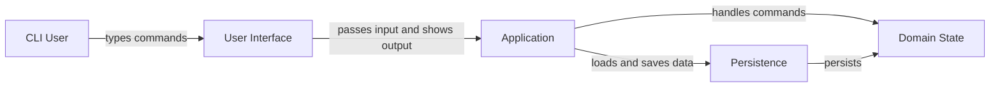

# SudoCook Architecture

This diagram reflects the implemented architecture in `src/main/java/seedu/sudocook`, not features described only in documentation.

## Notes

- `SudoCook` owns application startup, loads persisted state, runs the input loop, and routes commands using `instanceof`.
- `Parser` converts raw CLI text into a concrete `Command` subclass.
- The command layer is broad but shallow: most command classes delegate directly to `Inventory`, `RecipeBook`, or both.
- `Storage` is a simple file-based persistence layer that loads at startup and saves on shutdown using JSON files under `data/`.
- Output is not isolated to a single presentation layer. Commands, `Inventory`, and `RecipeBook` all call `Ui` directly.
